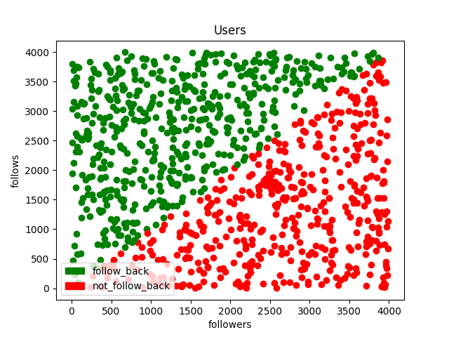

# InstaLearn
---
Class that allows you to predict whether a user will return a follow or not.

Labels:
- follow_back
- not_follow_back

> WARNING: the dataset in data/data.csv doesn't contain real data.

### How to install
```
composer require filippofinke/insta-learn
```

### How to use
```php
<?php
use FilippoFinke\InstaLearn;
use FilippoFinke\User;
require_once __DIR__ . '/vendor/autoload.php';
ini_set('memory_limit', '-1');

// Loading from a model
$il = new InstaLearn('model.model');
// Or $il->load('model.model');

// Creating a user
$user = new User();
// Get 'nasa' from the instagram API
$user->load('nasa');
// Predict the result
$prediction = $il->predict($user);
var_dump($prediction);

// Output: string(15) "not_follow_back"

```


### How to train
```php
<?php
use FilippoFinke\InstaLearn;

// Get the CsvDataset
$il = new InstaLearn();
// Train the classifier
$il->train('data/data.csv');
// Save the model
$il->save($model);
```

### How to get the training data
You have to do it by yourself.

### Visualization


### Authors
- Filippo Finke
